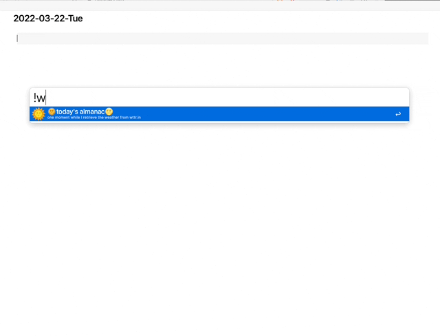

# alfred-almanac 

### Start your day with weather from [wttr.in](http://wttr.in/) and a daily almanac

<a href="https://github.com/giovannicoppola/alfred-almanac/releases/latest/">
 
</a>

<!-- MarkdownTOC autolink="true" bracket="round" depth="3" autoanchor="true" -->

- [Setting up](#setting-up)
- [Basic Usage](#usage)
- [Known Issues](#known-issues)
- [Acknowledgments](#acknowledgments)
- [Changelog](#changelog)
- [Feedback](#feedback)

<!-- /MarkdownTOC -->

# Setting up

### Needed

- Alfred with Powerpack license
- Python3 (howto install [here](https://www.freecodecamp.org/news/python-version-on-mac-update/))

### Setup
  
1. Download the most recent release of `alfred-almanac` from Github and double-click to install
2. In Alfred, open the 'Configure Workflow and Variables' window in `alfred-almanac` preferences
	
			
	- set the `LOCATION` variable to indicate the default locations as comma-separated city/town names, ZIP codes etc. 
	- _Optional:_ edit the `FORMATSTRING` variable to customize the oneliner from `wttr.in`. Options and instructions available at the `wttr.in` [github page](https://github.com/chubin/wttr.in#one-line-output). 
	- _Optional:_ set the `SPECIAL_DAY` variable (in the mm-dd format) to count days from and toward a special date. Default: `03-14` 
	
3. _Optional:_ Setup a hotkey to launch alfred-almanac
4. _Optional:_ Change the keyword to launch alfred-almanac
	- keyword currently set to `!w`

# Basic Usage 

- Launch `alfred-almanac` to retrieve weather and other almanac information from default locations ... 
- ... or enter a location/ZIP code directly

- The default weather string from `wttr.in` will output:
	- `%C` weather condition text
	- `%c` weather condition 
	- 🌡️`%t` actual temperature
	- `%f`  'feels like' temperature
	- `%h` humidity
	- 🌬️`%w` wind
	- `%m` moon phase

- The almanac section will output:
	- local date and time
	- Current week of the year
	- current quarter
	- days from and to the end of the year
	- days from and to the special day

- Enter (↩️) will copy to the clipboard and past to the frontmost application
- Shift-enter (⇧↩️) will open the corresponding page on `wttr.in` 
- CTRL-enter (⌃↩️) will show the almanac string in large font

# Known issues 
- Not tested extensively for international locations

# Acknowledgments
- [Igor Chubin](https://twitter.com/igor_chubin) for developing the amazing `wttr.in`
- The [Alfred forum](https://www.alfredforum.com) community. 

# Changelog

- 03-22-2022: version 1.0

# Feedback

Feedback welcome! If you notice a bug, or have ideas for new features, please feel free to get in touch either here, or on the [Alfred](https://www.alfredforum.com) forum. 

