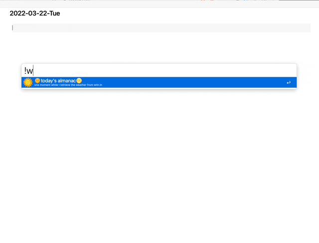
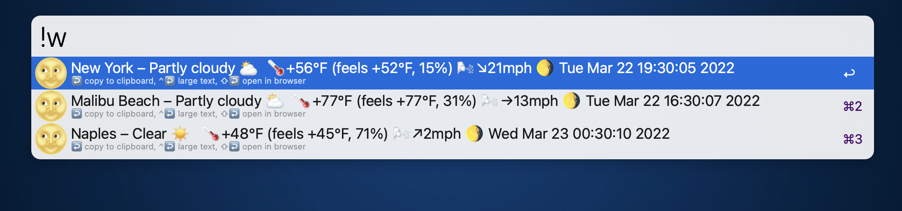

# alfred-almanac

### Start your day with weather and a daily almanac — plus optional weekly planning, a journal lookback, and an Obsidian daily note

<a href="https://github.com/giovannicoppola/alfred-almanac/releases/latest/">
 
</a>
<a href="https://alfred.app/workflows/giovannicoppola/almanac/">
 
</a>

<!-- MarkdownTOC autolink="true" bracket="round" depth="3" autoanchor="true" -->

- [Setting up](#setting-up)
- [Basic Usage](#basic-usage)
- [Optional features](#optional-features)
- [Known Issues](#known-issues)
- [Acknowledgments](#acknowledgments)
- [Changelog](#changelog)
- [Feedback](#feedback)

<!-- /MarkdownTOC -->

<h1 id="setting-up">Setting up</h1>

### Needed

- Alfred with Powerpack license
- Python 3 (macOS `/usr/bin/python3` is enough; third-party packages are bundled). Howto install [here](https://www.freecodecamp.org/news/python-version-on-mac-update/) if you need a newer interpreter.

### Setup

1. Download the most recent release of `alfred-almanac` from GitHub and double-click to install
2. _Optional:_ Click `Configure Workflow` in `alfred-almanac` preferences to change settings (default keyword: `!w`)
3. _Optional:_ Setup a hotkey to launch alfred-almanac

<h1 id="basic-usage">Basic Usage</h1>

- Launch with the workflow keyword (`!w` by default) to retrieve weather and other almanac information from default locations ...
- ... or enter a location/ZIP code directly. Comma-separated values (the default Location setting) produce one result per place.

- The default weather string from `wttr.in` will output:
	- `%C` weather condition text
	- `%c` weather condition
	- 🌡️`%t` actual temperature
	- `%f`  'feels like' temperature
	- `%h` humidity
	- 🌬️`%w` wind
	- `%m` moon phase
- The default `wttr.in` format string is `%C %c 🌡️%t (feels %f, %h) 🌬️%w %m` (editable as **wttr.in format**). These format codes apply to `wttr.in` only.
- Temperature can be shown in °F or °C (set **Temperature unit** in the configuration)
- The weather source can be switched from `wttr.in` to [OpenWeather](https://openweathermap.org) (set **Weather Info Source** and provide your own API key). OpenWeather uses a fixed summary (condition, temperature, feels-like, humidity, moon phase) and ignores the wttr.in format string.

- The almanac section will output:

	- local date and time (in the weather location's timezone)
	- current ISO week of the year
	- current quarter
	- day of the year and days remaining until December 31
	- days from and to the special day (**Special Day** in configuration, `MM-DD`)

- Enter (↩️) will copy to the clipboard and paste to the frontmost application (unless Obsidian daily-note append is enabled — see below)
- Shift-enter (⇧↩️) will open the corresponding page on `wttr.in` or OpenWeather, depending on your selected weather source
- CTRL-enter (⌃↩️) will show the almanac string in large font
- Option (⌥) will show the local date/time and timezone

<h1 id="optional-features">Optional features</h1>

**Weather Info Source** and **Temperature unit** are always available (defaults: `wttr.in`, °F). Weekly plan, line-a-day, and Obsidian daily note are **off by default** and can be enabled in `Configure Workflow`. Weekly plan and line-a-day append extra lines to the almanac output.

### Weather source & units
- **Weather Info Source:** `wttr.in` (default, no setup) or **OpenWeather**. For OpenWeather, get a free API key at [openweathermap.org](https://openweathermap.org/api) and paste it into **Open Weather API Key**.
- **Temperature unit:** `°F` (default) or `°C`. Applies to both sources.

### Weekly plan + task carryover
Enable **Add weekly plan** to append a link to the *filename* of this week's plan. This week's file is not created. On **Fridays** the output also includes next week's link; that file is created if missing, and any unchecked tasks (`- [ ]` at the start of a line) are copied from this week's file into it.

- **Notes folder:** any folder of Markdown (`.md`) files where the plans live — works with Obsidian, Logseq, VS Code, plain text, etc.
- **Weekly Plan Format:** pick the filename pattern (e.g. `Weekly plan (31) 2025-07-28 to 2025-08-01`).
- **Weekly Plan Link Style:** how the link is written — standard Markdown `[name](name.md)` (default), Obsidian/Logseq embed `![[name]]`, or plain filename.

See [`source/WEEKLY_PLAN_FORMATS.md`](source/WEEKLY_PLAN_FORMATS.md) for the full list of formats.

### Line-a-day lookback
Enable **Quote previous line-a-day items?** to append, for each complete year of history in the file, the journal entry whose date is closest to today minus that many years. Point **line-a-day file** at a Markdown file whose entries start with `- **` and contain a `YYYY-MM-DD` date. Pairs nicely with the companion [alfred-line-a-day](https://github.com/giovannicoppola/alfred-line-a-day) workflow.

### Obsidian daily note
Enable **Add report to Obsidian daily page?** to append the almanac output to today's daily note when you press Enter. Off by default. While this is on, Enter writes to the daily note and does **not** copy/paste to the frontmost app.

- **Obsidian Vault:** folder that contains the daily note files (vault root, or a Daily Notes subfolder). The path written is `{folder}/{title format}.md`.
- **Title format:** Python strftime pattern for the daily note filename (default `%Y-%m-%d-%a`). Include a subfolder here if notes are not directly in the folder you picked, e.g. `DailyNotes/%Y-%m-%d-%a`.
- **Create daily note if it doesn't exist:** off by default. When off, today's daily note must already exist or the append is skipped. When on, a missing daily note is created (including parent folders from the title format) and the report is written into it. This does not run Obsidian's Daily Notes template.

<h1 id="known-issues">Known issues</h1>
- Not tested extensively for international locations

<h1 id="acknowledgments">Acknowledgments </h1>
- [Igor Chubin](https://twitter.com/igor_chubin) for developing the amazing `wttr.in`
- [@vitorgalvao](https://github.com/vitorgalvao) for suggestions and great additions
- The [Alfred forum](https://www.alfredforum.com) community.

<h1 id="changelog">Changelog </h1>

- 2026-09-17: version 1.6.1, optional creation of today's Obsidian daily note if it does not exist (`OBSIDIAN_CREATE`)
- 2026-09-02: version 1.6.1, optional append of the almanac report to the Obsidian daily note (`OBSIDIAN_CHECK`)

- 06-30-2026: version 1.6 added optional features: OpenWeather source + °F/°C unit, weekly plan with Friday task carryover, and line-a-day lookback
- 11-30-2022: version 1.5 removed OneUpdater (for Alfred Gallery) 
- 11-01-2022: version 1.4 added timezones
- 09-29-2022: version 1.3 added OneUpdater, quicklookurl preview, keyword configurable (thanks @vitorgalvao!)
- 08-07-2022: version 1.2 merging @vitorgalvao's changes to update Workflow Environment Variables to User Configuration
- 03-30-2022: version 1.1 (switched to `requests` package for web request handling)
- 03-22-2022: version 1.0

<h1 id="feedback">Feedback</h1>
Feedback welcome! If you notice a bug, or have ideas for new features, please feel free to get in touch either here, or on the [Alfred](https://www.alfredforum.com) forum.
